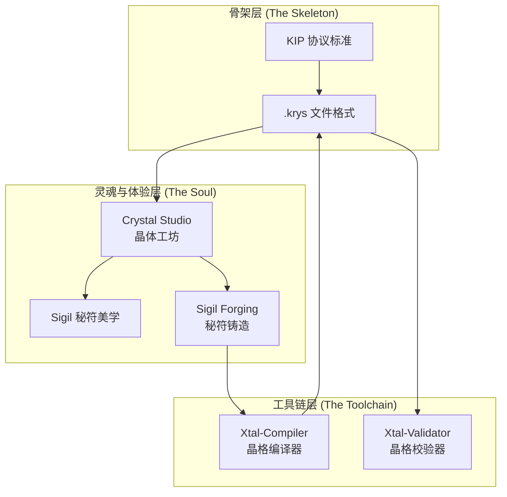
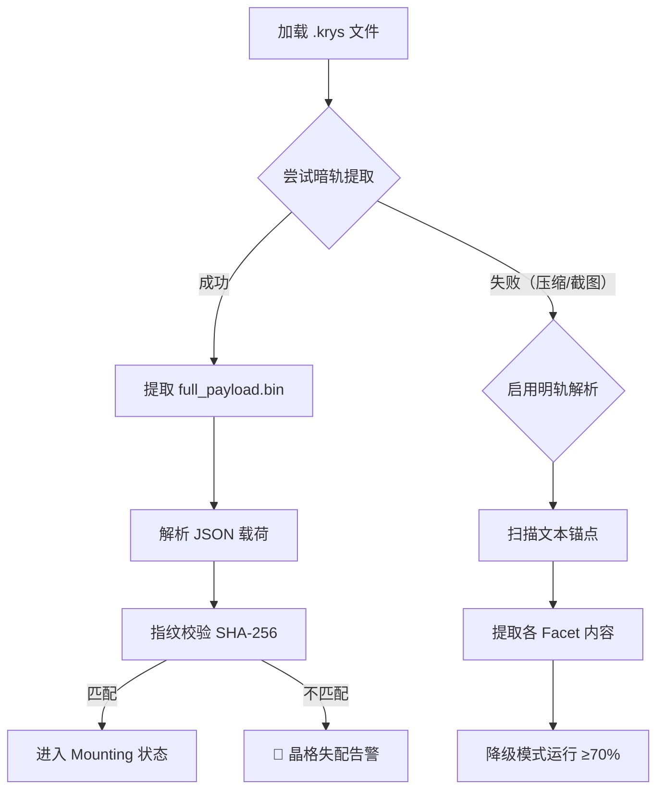

# KIP 前端工程开发指南 (Developer Guide)

> **面向 AI Agent 与人类开发者的完整实操手册**
> Version: 0.1 | Author: Emberois | Date: 2026-04-24

---

## 目录

1. [项目愿景与快速入门](#1-项目愿景与快速入门)
2. [架构总览 — 三位一体](#2-架构总览--三位一体)
3. [术语对照表](#3-术语对照表)
4. [渲染规范详解 — Canvas/SVG 制图](#4-渲染规范详解--canvassvg-制图)
5. [解析器实现指南 — 暗轨/明轨双轨制](#5-解析器实现指南--暗轨明轨双轨制)
6. [状态机实现 — Crystal Runtime](#6-状态机实现--crystal-runtime)
7. [安全检查清单](#7-安全检查清单)
8. [AI Agent 接入指引](#8-ai-agent-接入指引)
9. [附录：色值速查 / 锚点关键词 / 晶级分类](#9-附录)

---

## 1. 项目愿景与快速入门

### 1.1 什么是 KIP？

**KIP (Krystallized Intent Protocol，晶化意图协议)** 定义了一种**全新的 AI 能力封装范式**：将 AI 提示词、逻辑代码和执行指令编码进一张视觉图像中，生成可跨平台传递的 `.krys` 文件。

**核心价值主张**：
- 🌐 **模型无关 (Model-Agnostic)**：任何多模态 AI 都能读取并执行
- 📦 **自包含 (Self-Contained)**：一个文件即完整能力载体
- 🛡️ **抗压缩 (Compression-Resistant)**：在微信/微博等社交压缩下仍可降级恢复
- 🔒 **防篡改 (Tamper-Proof)**：SHA-256 指纹 + 带隙色值双重校验
- ✈️ **离线优先 (Offline-First)**：1-2 晶级文件完全断网可用

### 1.2 核心概念速览

```
┌─────────────────────────────────────────────────────┐
│                    .krys 文件                        │
│                                                     │
│   ┌─────────────────────────────────────────────┐   │
│   │        视觉层 (人看)                         │   │
│   │   ┌─────────────────────────────────────┐   │   │
│   │   │  晶核 (Core)  — 美学隐喻 40%        │   │   │
│   │   │  带隙 (Band Gap) — 安全色环 1-2px   │   │   │
│   │   │  六晶面 (6 Facets) — 金丝编码边框    │   │   │
│   │   └─────────────────────────────────────┘   │   │
│   └─────────────────────────────────────────────┘   │
│   ┌─────────────────────────────────────────────┐   │
│   │        隐写层 (AI看)                         │   │
│   │   full_payload.bin → JSON 载荷              │   │
│   └─────────────────────────────────────────────┘   │
└─────────────────────────────────────────────────────┘
```

---

## 2. 架构总览 — 三位一体



### 层级职责划分

| 层级 | 核心职责 | 面向对象 |
| :--- | :------- | :------- |
| **骨架层** | 定义协议标准、文件格式、数据编码规则 | 协议制定者 |
| **灵魂与体验层** | 提供前端界面、美学规范、用户交互体验 | 普通用户 |
| **工具链层** | 提供编译器、校验器、开发者 SDK | 开发者 / AI Agent |

---

## 3. 术语对照表

> ⚠️ **强制规范**：在所有 KIP 合规代码中，**禁止**使用"禁用"列的词汇。

| 传统术语 ❌ | KIP 术语 ✅ | 英文 | 说明 |
| :---------- | :---------- | :--- | :--- |
| 应用/App | 晶体 | Crystal / Krystal | 能力载体 |
| 安装 | 结晶 | Crystallize | 打包生成 .krys |
| 运行/执行/调用 | 折射 | Refract | 模型读取并执行 |
| 卸载/删除 | 解理 | Cleavage | 终止并清理状态 |
| 报错/异常/Bug | 晶格缺陷 | Lattice Defect | 运行时错误 |
| 容器 | 晶体载体 | Krystal Carrier | 文件容器 |
| 插件/扩展 | 切面 | Facet | 功能模块 |
| 工作流/管线 | 晶簇组装 | Cluster Assembly | 多晶体编排 |
| 更新/升级 | 重结晶 | Recrystallize | 版本迭代 |
| 外部数据源 | 包裹体 | Inclusion | 外部 API/知识指针 |
| 校验失败 | 晶格失配 | Lattice Mismatch | 安全校验不通过 |
| 功能展开 | 色散 | Dispersion | 能力分解为 UI 切面 |

---

## 4. 渲染规范详解 — Canvas/SVG 制图

### 4.1 画布初始化

```javascript
// 示例：Canvas 初始化
const CANVAS_SIZE = 1024; // 或 1536
const canvas = document.createElement('canvas');
canvas.width = CANVAS_SIZE;
canvas.height = CANVAS_SIZE;
const ctx = canvas.getContext('2d');
```

**强制约束**：
- ✅ 分辨率：`1024×1024` 或 `1536×1536`（正方形）
- ✅ 色彩空间：sRGB
- ❌ 禁止非正方形比例

### 4.2 三层渲染顺序

渲染必须严格按照**从外到内**的图层顺序执行：

```
渲染顺序：
  1. 底层画布 (Background)
  2. 六晶面 (6 Facets) — 边框区域，Data Filigree 编码
  3. 象限锁定锚点 (Quadrant Lock Anchors) — 2×2px 品红色块
  4. 带隙 (Band Gap) — 1-2px 安全色环
  5. 晶核 (Core) — 中心 40% 美学区域
```

### 4.3 六晶面尺寸计算

以 `1024×1024` 画布为例：

```javascript
const S = 1024;
const CORE_RATIO = 0.40;
const CORE_SIZE = S * Math.sqrt(CORE_RATIO); // ≈ 647px (面积占比 40%)
const CORE_OFFSET = (S - CORE_SIZE) / 2;     // ≈ 188px

// 各晶面边框区域（像素范围）
const FACET_REGIONS = {
  crown:      { x: CORE_OFFSET, y: 0,              w: CORE_SIZE, h: CORE_OFFSET },
  input:      { x: CORE_OFFSET + CORE_SIZE, y: 0,  w: S - CORE_OFFSET - CORE_SIZE, h: S / 2 },
  logic:      { x: CORE_OFFSET + CORE_SIZE, y: S/2, w: S - CORE_OFFSET - CORE_SIZE, h: S / 2 },
  output:     { x: CORE_OFFSET, y: CORE_OFFSET + CORE_SIZE, w: CORE_SIZE, h: S - CORE_OFFSET - CORE_SIZE },
  inclusion:  { x: 0, y: S / 2,             w: CORE_OFFSET, h: S / 2 },
  correction: { x: 0, y: 0,                 w: CORE_OFFSET, h: S / 2 },
};
```

### 4.4 象限锁定锚点

```javascript
// 在每个晶面交界处嵌入 2×2 品红色块
const ANCHOR_COLOR = '#FF00FF';
const ANCHOR_SIZE = 2;

const ANCHOR_POSITIONS = [
  { x: 0, y: 0 },                          // 左上角
  { x: S - ANCHOR_SIZE, y: 0 },            // 右上角
  { x: 0, y: S - ANCHOR_SIZE },            // 左下角
  { x: S - ANCHOR_SIZE, y: S - ANCHOR_SIZE }, // 右下角
  { x: CORE_OFFSET, y: CORE_OFFSET },      // Core 左上
  { x: CORE_OFFSET + CORE_SIZE, y: CORE_OFFSET },       // Core 右上
  { x: CORE_OFFSET, y: CORE_OFFSET + CORE_SIZE },       // Core 左下
  { x: CORE_OFFSET + CORE_SIZE, y: CORE_OFFSET + CORE_SIZE }, // Core 右下
];

function renderAnchors(ctx) {
  ctx.fillStyle = ANCHOR_COLOR;
  ANCHOR_POSITIONS.forEach(pos => {
    ctx.fillRect(pos.x, pos.y, ANCHOR_SIZE, ANCHOR_SIZE);
  });
}
```

### 4.5 带隙渲染

```javascript
const BAND_GAP_COLORS = {
  safe:       '#0BDA51', // 孔雀石绿
  caution:    '#FFBF00', // 琥珀金
  restricted: '#E30022', // 辰砂红
  tool:       '#2979FF', // 标准蓝
  multimodal: '#B388FF', // 幻影紫
};

function renderBandGap(ctx, level) {
  ctx.strokeStyle = BAND_GAP_COLORS[level];
  ctx.lineWidth = 2;
  ctx.strokeRect(CORE_OFFSET, CORE_OFFSET, CORE_SIZE, CORE_SIZE);
  // 可选：添加外发光效果 (glow)
  ctx.shadowColor = BAND_GAP_COLORS[level];
  ctx.shadowBlur = 8;
  ctx.strokeRect(CORE_OFFSET, CORE_OFFSET, CORE_SIZE, CORE_SIZE);
  ctx.shadowBlur = 0;
}
```

---

## 5. 解析器实现指南 — 暗轨/明轨双轨制

### 5.1 解析流程



### 5.2 暗轨提取实现

```javascript
async function extractDarkTrack(file) {
  // 方式 1：PNG Chunk 提取 (推荐)
  const chunks = parsePNGChunks(file);
  const kipChunk = chunks.find(c => c.type === 'kiPl'); // KIP Payload chunk
  if (kipChunk) {
    return JSON.parse(new TextDecoder().decode(kipChunk.data));
  }

  // 方式 2：LSB 隐写提取
  const lsbData = extractLSB(file);
  if (lsbData && isValidJSON(lsbData)) {
    return JSON.parse(lsbData);
  }

  // 方式 3：Zip 容器解压
  const zipEntries = await unzip(file);
  const payload = zipEntries.find(e => e.name === 'full_payload.bin');
  if (payload) {
    return JSON.parse(new TextDecoder().decode(payload.data));
  }

  // 暗轨全部失败 → 返回 null，触发明轨降级
  return null;
}
```

### 5.3 明轨文本锚点解析

```javascript
const ANCHOR_KEYWORDS = ['[CROWN]', '[INPUT]', '[LOGIC]', '[OUTPUT]', '[INCLUSION]', '[CORRECTION]'];

function parseLightTrack(ocrText) {
  const facets = {};

  ANCHOR_KEYWORDS.forEach(anchor => {
    const facetName = anchor.replace(/[\[\]]/g, '').toLowerCase();
    const regex = new RegExp(`\\${anchor}\\s*([\\s\\S]*?)(?=\\[|$)`, 'i');
    const match = ocrText.match(regex);
    if (match) {
      facets[facetName] = match[1].trim();
    }
  });

  return facets;
}
```

### 5.4 指纹校验

```javascript
async function verifyFingerprint(visualPixels, jsonPayload, bandGapColor) {
  const combined = new TextEncoder().encode(
    visualPixels + JSON.stringify(jsonPayload) + bandGapColor
  );
  const hashBuffer = await crypto.subtle.digest('SHA-256', combined);
  const hashArray = Array.from(new Uint8Array(hashBuffer));
  const computedHash = hashArray.map(b => b.toString(16).padStart(2, '0')).join('');

  const embeddedHash = jsonPayload.fingerprint?.hash;
  if (computedHash !== embeddedHash) {
    throw new LatticeMismatchError(
      `⚠️ 晶格失配 (Lattice Mismatch) — 哈希不一致！ 
       computed: ${computedHash} 
       embedded: ${embeddedHash}`
    );
  }
  return true;
}
```

---

## 6. 状态机实现 — Crystal Runtime

### 6.1 状态定义

```javascript
const CrystalState = Object.freeze({
  IDLE:        'IDLE',        // 初始空闲
  MOUNTING:    'MOUNTING',    // 挂载中（加载文件）
  VALIDATING:  'VALIDATING',  // 晶格校验（安全检查）
  DISPERSING:  'DISPERSING',  // 色散中（Facets → UI）
  REFRACTING:  'REFRACTING',  // 折射中（模型执行）
  COMPLETE:    'COMPLETE',    // 执行完成
  DEFECT:      'DEFECT',      // 晶格缺陷（错误）
  MISMATCH:    'MISMATCH',    // 晶格失配（安全告警）
  CLEAVAGE:    'CLEAVAGE',    // 解理（终止清理）
});
```

### 6.2 事件常量

```javascript
const CrystalEvent = Object.freeze({
  CR_CRYSTALLIZE:    'CR_CRYSTALLIZE',
  CR_RECRYSTALLIZE:  'CR_RECRYSTALLIZE',
  CR_REFRACT:        'CR_REFRACT',
  CR_DISPERSE:       'CR_DISPERSE',
  CR_CLEAVAGE:       'CR_CLEAVAGE',
  CR_DEFECT:         'CR_DEFECT',
  CR_MISMATCH:       'CR_MISMATCH',
  CR_CLUSTER:        'CR_CLUSTER',
});
```

### 6.3 状态转换表

```javascript
const STATE_TRANSITIONS = {
  [CrystalState.IDLE]: {
    [CrystalEvent.CR_CRYSTALLIZE]:   CrystalState.MOUNTING,
  },
  [CrystalState.MOUNTING]: {
    'PARSE_SUCCESS':                  CrystalState.VALIDATING,
    [CrystalEvent.CR_DEFECT]:        CrystalState.DEFECT,
  },
  [CrystalState.VALIDATING]: {
    'VALIDATION_PASS':               CrystalState.DISPERSING,
    [CrystalEvent.CR_MISMATCH]:      CrystalState.MISMATCH,
    [CrystalEvent.CR_DEFECT]:        CrystalState.DEFECT,
  },
  [CrystalState.DISPERSING]: {
    [CrystalEvent.CR_REFRACT]:       CrystalState.REFRACTING,
  },
  [CrystalState.REFRACTING]: {
    'REFRACT_COMPLETE':              CrystalState.COMPLETE,
    [CrystalEvent.CR_DEFECT]:        CrystalState.DEFECT,
  },
  [CrystalState.COMPLETE]: {
    [CrystalEvent.CR_CLEAVAGE]:      CrystalState.CLEAVAGE,
    [CrystalEvent.CR_RECRYSTALLIZE]: CrystalState.MOUNTING,
  },
  [CrystalState.CLEAVAGE]: {
    'CLEAN_COMPLETE':                CrystalState.IDLE,
  },
};
```

---

## 7. 安全检查清单

在每次折射 (Refract) 前，系统**必须**完成以下所有检查：

### 7.1 Pre-Refraction Checklist

- [ ] **指纹校验**：`SHA-256(视觉像素 + JSON载荷 + 带隙色值)` 与嵌入值匹配
- [ ] **带隙权限检查**：
  - 🟢 Safe → 静默通过
  - 🟡 Caution → 弹窗提示外部网络请求
  - 🔴 Restricted → **强制阻断** + 二次确认
- [ ] **黑名单比对**：晶体 ID 不在恶意晶体黑名单中
- [ ] **晶级降级检查**：
  - Tier 1/2 → 确认不含外部依赖
  - Tier 3 → 确认 Correction Facet 包含离线降级方案
- [ ] **网络状态检测**：
  - 在线 → 正常折射
  - 离线 + Tier 1/2 → 正常折射（本地模型）
  - 离线 + Tier 3 → 启用 Correction Facet 降级路径

### 7.2 晶格失配应急流程

```
检测到哈希不匹配
  ↓
立即中断折射流程
  ↓
前端状态 → MISMATCH
  ↓
显示高危告警：
  "⚠️ 晶格失配 (Lattice Mismatch)
   此晶体的视觉数据与底层载荷不一致。
   可能已被篡改。强烈建议丢弃此晶体。"
  ↓
用户选择：[丢弃晶体] / [强制继续（需二次输入确认码）]
```

---

## 8. AI Agent 接入指引

### 8.1 作为 System Prompt 使用

将五大模块文档或本开发指南直接作为 AI Agent 的 System Prompt 注入。推荐的 prompt 前缀：

```
你是一个 KIP (Krystallized Intent Protocol) 合规的前端开发 Agent。
你必须严格遵循 KIP 协议规范 SPEC-KIP-0.1 中的所有术语、
渲染规范、解析协议和安全模型。

以下是你的核心知识库：
[插入本文档或五大模块内容]
```

### 8.2 Agent 交接协议

当一个 AI Agent 将开发工作交接给另一个 Agent 时，必须传递：

1. **SPEC-KIP-0.1.md** — 协议规范（不可省略）
2. **当前代码仓库状态** — Git commit hash + 分支信息
3. **当前任务进度** — task.md 或等效进度文档
4. **已知晶格缺陷列表** — 已发现但未修复的问题

### 8.3 Agent 合规性自检

Agent 在产出任何代码或文档前，应自检以下条件：

- [ ] 是否在代码中使用了禁用术语？（见术语对照表）
- [ ] 组件命名是否遵循 KIP 词汇表？
- [ ] Canvas/SVG 渲染是否符合三层六面规范？
- [ ] 解析器是否实现了暗轨优先 + 明轨降级？
- [ ] 状态机是否包含完整的 CR 生命周期？
- [ ] 安全检查是否覆盖了 Pre-Refraction Checklist 全部项？

---

## 9. 附录

### 9.1 色值速查表

| 名称 | 中文 | Hex | RGB | 用途 |
| :--- | :--- | :-- | :-- | :--- |
| Malachite Green | 孔雀石绿 | `#0BDA51` | `(11, 218, 81)` | 带隙 — 安全 |
| Amber Gold | 琥珀金 | `#FFBF00` | `(255, 191, 0)` | 带隙 — 警告 |
| Cinnabar Red | 辰砂红 | `#E30022` | `(227, 0, 34)` | 带隙 — 高危 |
| Standard Blue | 标准蓝 | `#2979FF` | `(41, 121, 255)` | 带隙 — 工具 |
| Phantom Purple | 幻影紫 | `#B388FF` | `(179, 136, 255)` | 带隙 — 多模态 |
| Magenta | 品红 | `#FF00FF` | `(255, 0, 255)` | 象限锁定锚点 |

### 9.2 文本锚点关键词

```
[CROWN]  [INPUT]  [LOGIC]  [OUTPUT]  [INCLUSION]  [CORRECTION]
```

### 9.3 晶级分类

| 晶级 | 名称 | 离线能力 | 外部依赖 | 带隙颜色 |
| :--- | :--- | :------- | :------- | :------- |
| 1 | Pure Crystal | ✅ 100% 离线 | 无 | 🟢 绿色 |
| 2 | Enhanced Crystal | ✅ 100% 离线 | 无 | 🟢 绿色 |
| 3 | Connected Crystal | ⚠️ 降级离线 | 含 Inclusion | 🟡 黄色 / 🔴 红色 |

---

*Developer Guide v0.1 — Authored by Emberois — 2026-04-24*
*Licensed under CC BY-SA 4.0*
